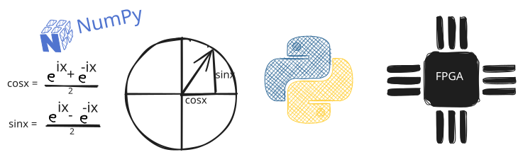

# Introduction

Random topics mostly related to FPGA, SDR, and DSP. This targeted to anyone who might
benefit from the topics metioned here. The author is a hobbyist and is learning as he goes.
so any feedback is welcome.

## What to expect from this website

- Use python for DPS algorithms using numpy and scify, matplotlib for plotting signals, and PyQT for GUIs.
- Use python for FPGA related topics using cocotb for testbenches.
- Use python for SDR related topics using pyadi-iio and pyqtgraph for plotting signals.
- The author owns a PlutoSDR, any SDR related topics will be around this device.